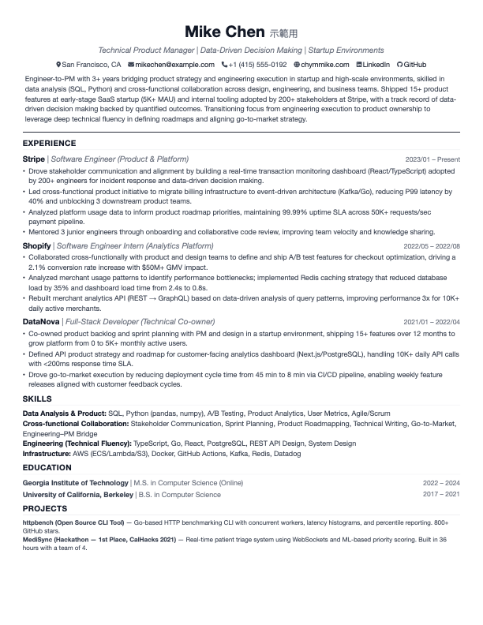

# AI-Resume-GPS 🛰️

> **AI 驅動的求職導航系統。**
> 透過進階 AI 工作流，精準對齊你的個人資料與任意職缺 JD。

這是一個 Python 履歷生成工具，核心特色是 **AI 協作工作流系統**，幫助求職者精準針對企業 ATS 篩選機制、主動規避求職 Risk Signal。

## 範例預覽

以下是由本工具生成的**示範用**履歷。

### 通用版本 (Software Engineer)


*(註：以上範例資料皆為虛構，僅供展示排版與內容架構使用。)*

---

### 客製版本 (Product Manager)


*(註：以上範例資料皆為虛構，僅供展示排版與內容架構使用。)*

## 功能特色

- **JSON 資料模組化** — 個人資料與呈現完全分離
- **多版本管理** — 通用版本（PM、Ops、Strategy）+ 公司特定客製版
- **HTML & PDF 輸出** — 基於 WeasyPrint，Letter size，可直接列印
- **AI Agent 工作流** — 從 JD 到履歷全自動 pipeline：
  - `/profile-init` — 引導式訪談，建立個人資料庫
  - `/jd-save` — 存檔職缺 JD 到應徵記錄資料庫
  - `/jd-match` — 分析個人資料與 JD 的契合度
  - `/jd-resume` — 產出客製化履歷 JSON + PDF
  - `/jd-aiproof` — 模擬 AI HR 審查，執行 SWOT + Risk Signal 分析
- **防幻覺機制** — AI 只能重組你的真實經歷，不允許捏造

## 目錄結構

```
AI-Resume-GPS/
├── data/
│   ├── master_profile.example.json  # 個人資料範本（技能與經歷原始資料）
│   ├── experience_notes.example.md  # 工作筆記範本（含量化數據）
│   ├── resume_example.json          # 範例：通用版（SWE）
│   └── resume_example_corp_pm.json  # 範例：客製版（PM）
├── templates/
│   └── default.html                 # HTML 模板（inline CSS + Font Awesome）
├── scripts/
│   └── generate.py                  # 生成器（Mustache-like 引擎 + WeasyPrint）
├── assets/fonts/                    # Font Awesome woff2（本地字型，PDF 用）
├── output/                          # 生成的 HTML + PDF
├── jobs/                            # 應徵職缺資料庫
│   └── {Company}/{Role}/JD.md       # 存檔的 JD 與 metadata
└── .agent/                          # AI Agent 設定
    ├── skills/profile-conventions/  # master_profile & experience_notes 格式規範
    ├── skills/resume-conventions/   # Resume JSON schema & 命名慣例
    └── workflows/                   # /profile-init, /jd-save, /jd-match, /jd-resume, /jd-aiproof
```

## 快速開始

### 0. 環境需求

- **Python 3.8+**（建議 3.10+）
- macOS / Linux（Windows：WeasyPrint 需要額外設定，不正式支援）

### 1. 安裝依賴

```bash
python3 -m venv .venv
source .venv/bin/activate   # Windows: .venv\Scripts\activate
pip install -r requirements.txt
```

> **macOS PDF 注意**：WeasyPrint 需要系統 C 函式庫。
> 若出現 `cannot load library 'libgobject-2.0-0'`，執行：
> ```bash
> brew install cairo pango gdk-pixbuf libffi
> ```
> `generate.py` 會自動設定必要的環境變數，不需要手動 export。

### 2. 建立個人資料

```bash
cp data/master_profile.example.json data/master_profile.json
cp data/experience_notes.example.md data/experience_notes.md
# 用你的真實經歷填寫這兩份檔案
```

### 3. 生成履歷

```bash
# 從範例檔生成
python3 scripts/generate.py

# 指定特定版本
python3 scripts/generate.py --profile resume_example

# 只輸出 HTML（跳過 PDF）
python3 scripts/generate.py --html-only

# 生成後在瀏覽器預覽
python3 scripts/generate.py --preview
```

### 4. 建立公司特定版本

```bash
# 推薦使用 /jd-resume workflow，或手動建立：
# data/resume_google_pm.json

# 生成 —— 輸出自動路由到 output/apps/Google-Pm/
python3 scripts/generate.py --profile resume_google_pm
```

## AI 工作流使用方式

這些工作流設計給支援 `.agent/` 慣例的 AI 編程助理使用（例如 Cursor、Windsurf、Gemini Code Assist）。

### 建議執行順序

```
/profile-init → /jd-save → /jd-match → /jd-resume → /jd-aiproof
```

### `/profile-init` — 建立個人資料
首次設定時執行。AI 引導你完成結構化訪談（或解析現有履歷），產出 `master_profile.json` 和 `experience_notes.md`。

### `/jd-save` — 存檔 JD
貼入職缺描述 → 自動存到 `jobs/{Company}/{Role}/JD.md` 並附加 metadata。

### `/jd-match` — 適合度分析
貼入 JD → 產出結構化報告，包含符合度評分、優劣勢、包裝建議，以及 **Risk Signal 清單**（AI HR 可能標記的危險項目）。

### `/jd-resume` — 生成客製履歷
貼入 JD → AI 萃取核心能力關鍵字 → 讀取個人資料 + 筆記 → 生成關鍵字對齊的 `resume_*.json` → 執行 `generate.py` → 輸出 PDF。

### `/jd-aiproof` — AI HR 模擬審查
針對已生成的履歷，AI 扮演 **HR AI 篩選系統**，執行 SWOT 分析 + Risk Signal 掃描，找出弱點並提供具體到句子層級的修改建議。

## 運作原理

```
master_profile.json ──┐
                      ├──→ resume_*.json ──→ generate.py ──→ HTML/PDF
experience_notes.md ──┘         ▲
                                │
                          AI workflows
                          讀取 JD 後
                          重新包裝
```

1. **`master_profile.json`** — 個人資料唯一來源（不隨 JD 變動）
2. **`experience_notes.md`** — 含量化數據的原始工作筆記，供撰寫 bullet 時取用
3. **`resume_*.json`** — 各版本客製履歷，每份針對特定職位/公司優化
4. **`generate.py`** — 純渲染器：JSON → HTML 模板 → PDF

## 客製化

### 修改模板
編輯 `templates/default.html`，所有 CSS 均為 inline。

### 新增通用版本
建立 `data/resume_yourversion.json`，並在 `generate.py` 的 `generic_map` 中新增對應。

### 輸出路徑路由
公司特定版本自動路由：`resume_google_pm` → `output/apps/Google-Pm/`。
無需手動設定。

## 作者

**Chymmike**
- GitHub: [github.com/chymmike](https://github.com/chymmike)
- Website: [chymmike.com](https://chymmike.com)

## 授權

MIT
